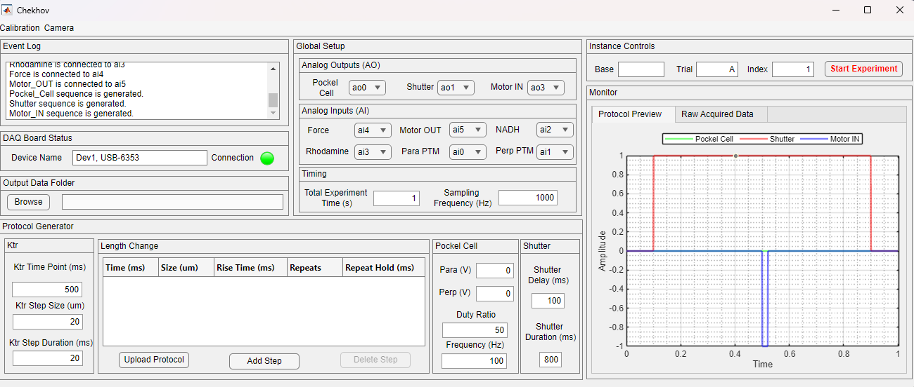

## Chekhov

Chekhov is a software which can generate and collect different sorts of signals from a multi purpose muscle mechanics setup. For more detail on these sort of experiments, following publication is a good place to start: [The regulatory light chain mediates inactivation of myosin motors during active shortening of cardiac muscle by Thomas Kampourakis & Malcolm Irving](https://www.nature.com/articles/s41467-021-25601-8)

