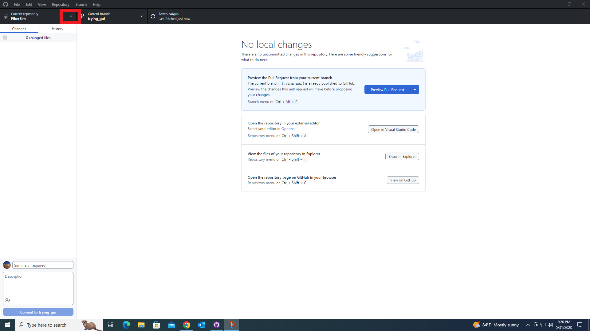
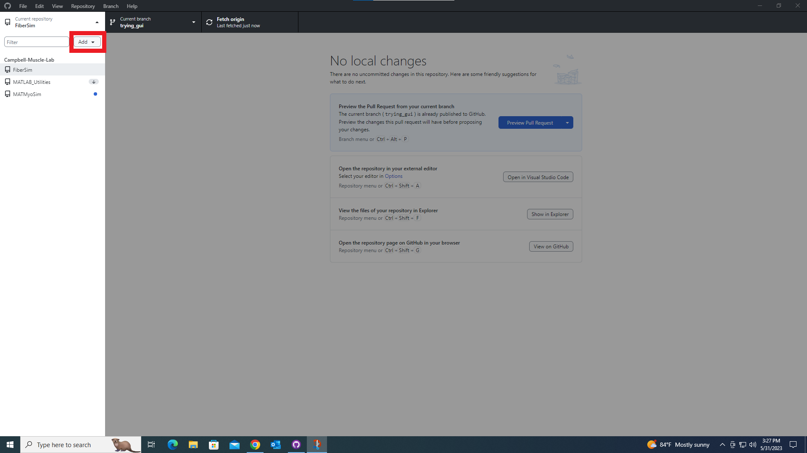
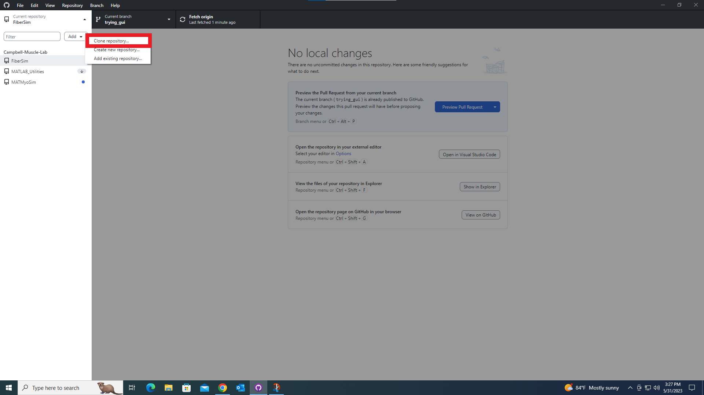
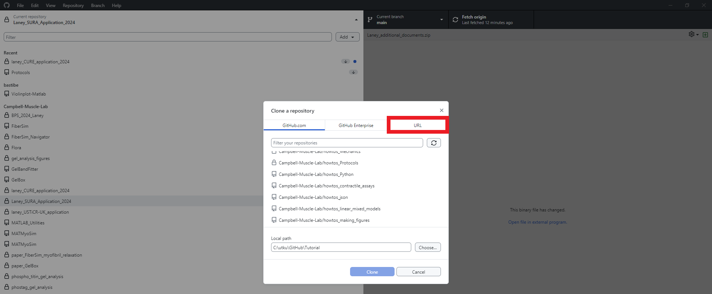
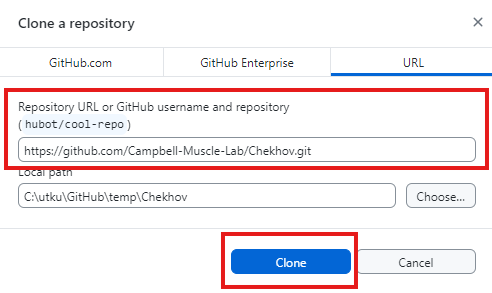

# Installation

## Cloning Chekhov Repository

This page instructs you on how to clone the Chekhov repository.

We recommend cloning the Chekhov repository using the [GitHub Desktop client.](https://desktop.github.com/)

Clicking on any of the images on this page will open a larger version in a new browser window.

Open GitHub Desktop and click the dropdown menu for repositories (shown in red rectangle in the below image).

<a href="media/github_desktop.png" target="_blank"></a>

Click the “Add” dropdown menu (shown in red rectangle in the below image).

<a href="media/github_desktop_expanded.png" target="_blank"></a>

Click the “Clone repository…” button (shown in red rectangle in the below image).

<a href="media/clone_repo.png" target="_blank"></a>

Click the URL tab shown in the red rectangle.

<a href="media/all_repos.png" target="_blank"></a>

The URL of the Chekhov repo is :
```
https://github.com/Campbell-Muscle-Lab/Chekhov.git
```

Enter the URL in the textbox shown in the red rectangle. Select the location you would like to store the cloned repository.

<a href="media/chekhov_repo.png" target="_blank"></a>

Chekhov repo is successfully cloned to your computer.