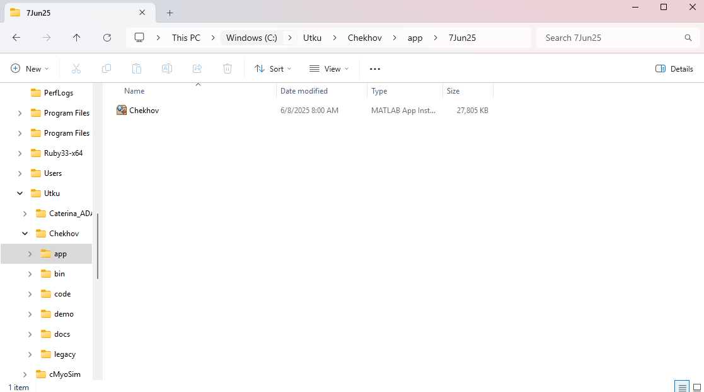
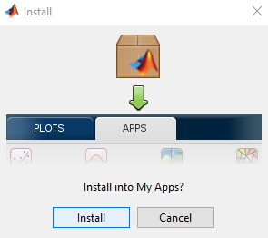
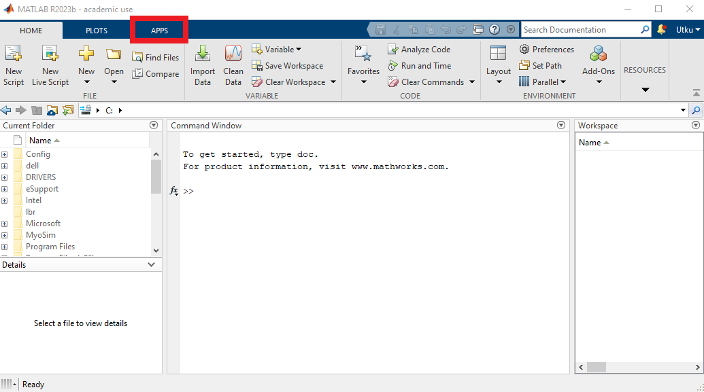

# Installation

## Instructions for MATLAB App Installation

This page instructs you on how to install Chekhov as a MATLAB App.

+ The MATLAB App installer file can be downloaded from the [GitHub page](https://github.com/Campbell-Muscle-Lab/Chekhov/tree/main/app/7Jun25). 7Jun25 installer is the current Chekhov build. In this case, the installer file is located under your designated Downloads folder.
+ Users can also clone the Chekhov repository and access the MATLAB App installer file. The installer file is located under `<repo>app\7Jun25`.  The instructions on how to clone a repository can be found [here](../cloning_Chekhov/cloning_gel_box.html).

Locate `Chekhov.mlappinstall` file on your computer.

Double-click the `Chekhov.mlappinstall` and the file will include Chekhov in your MATLAB Applications. Click Install when the below prompt appears.

After a couple of seconds, go to the Apps tab on the top menu of your MATLAB, shown in red rectangle.

You can find the Chekhov application under the My Apps section, shown in red rectangle.

Now Chekhov is ready to be used.
