# Getting Started

This page provides simple instructions on performing an experiment with Chekhov.

## Instructions

+ Using the Chekhov through MATLAB:
    - Launch MATLAB and navigate to the Apps tab on the top menu. Find the Chekhov under My Apps and start the application by clicking it. The instructions on how to locate the Apps tab can be found [here](../../installation/installing_matlab_app/installing_matlab_app.html)

+ Using the Chekhov as a stand-alone application:
    - Locate your `Chekhov.exe` shortcut and start the application by double-clicking it.

After a few seconds, you should see a program window. Here is the Chekhov interface. (Clicking on any of the images on this page will open a larger version in a new browser window.).

The interface is divided into multiple panels and multiple functional windows.

### Event Log

It communicates with the user to highlight key events, such as DAQ connection, input/output channel assignment, data writing, etc.

<a href="media/event_log.png" target="_blank">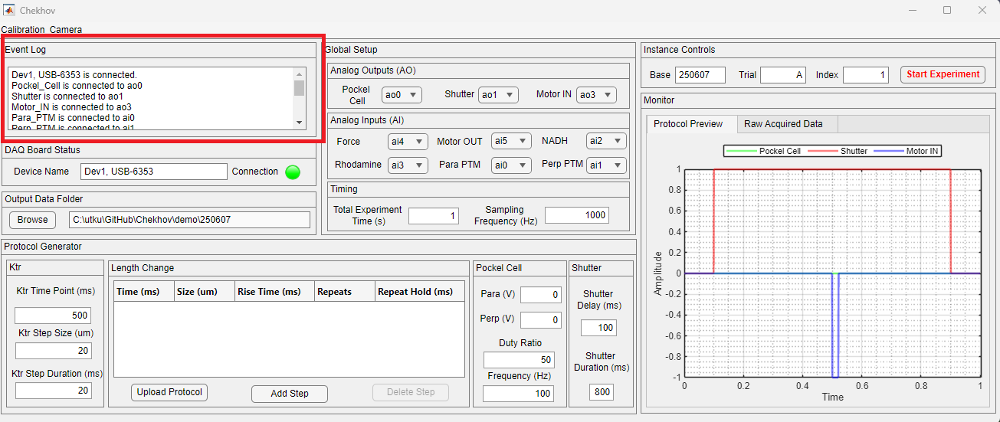</a>

### DAQ Board Status

It shows the name of the connected DAQ device. The connection lamp turns to green once the connection is initiated.

<a href="media/DAQ_board.png" target="_blank">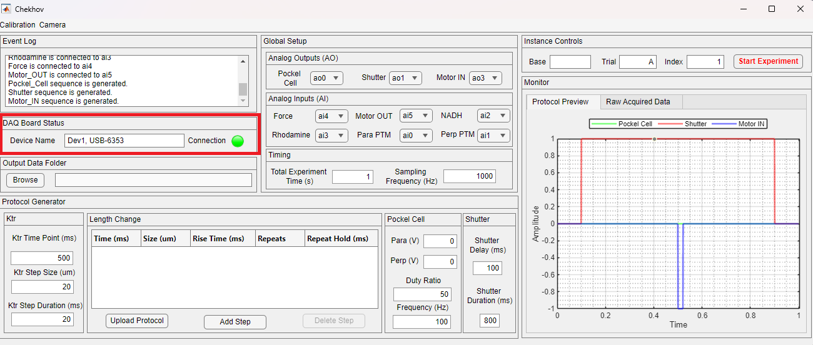</a>

### Output Data Folder

It shows the main directory for the data storage.

Click the Folder button shown in red rectangle. A Windows dialog window will open and select the top folder for your data storage. The data folder is generated with respect to the date.

<a href="media/folder.png" target="_blank">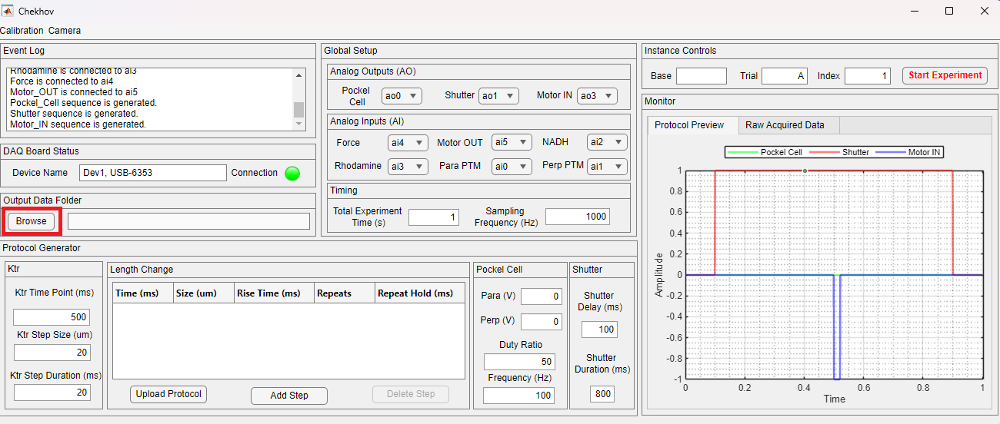</a>

<a href="media/browse_folder.png" target="_blank">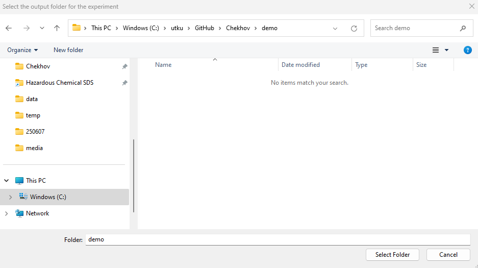</a>

The selected folder will appear on the main window.

<a href="media/folder_filled.png" target="_blank">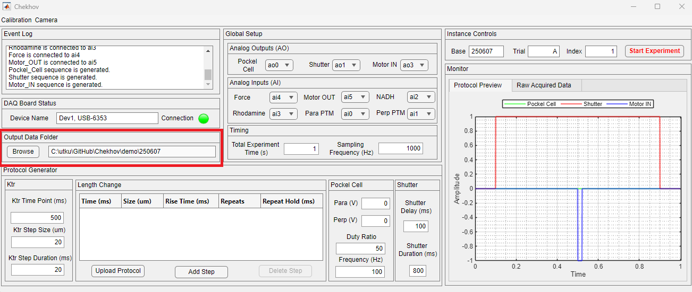</a>

### Instance Controls

The experiment naming follows the lab standards with additional information on the prep id and repeat. For instance, the first trial with the first prep on June 9th, 2025 are named as follows: 20250609_A_1.

The fields are filled after the selected folder.

<a href="media/instance_controls.png" target="_blank">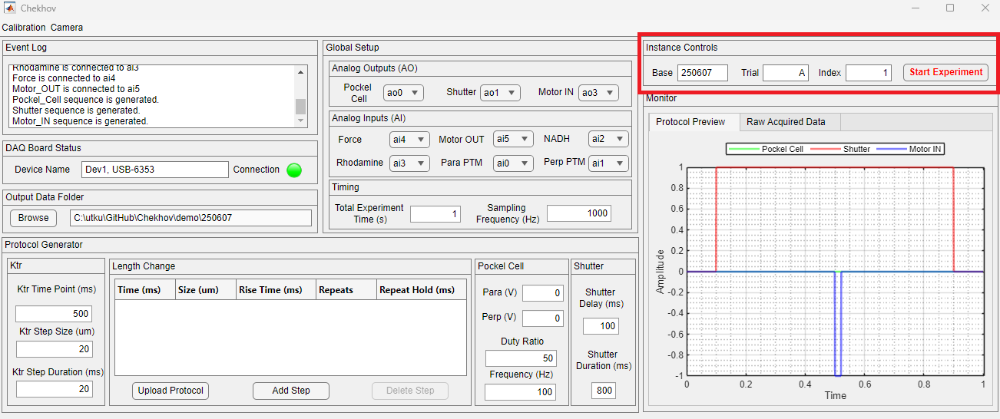</a>

### Camera

Chekhov is integrated with a Thorlabs camera for brightfield imaging. To access to the camera interface, click the Camera on the top menu, shown in red rectangle.

<a href="media/camera.png" target="_blank">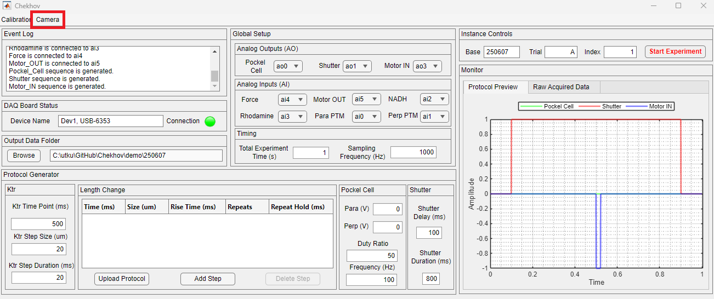</a>

The ChekhovCamera interface opens momentarily.

<a href="media/camera_app.png" target="_blank">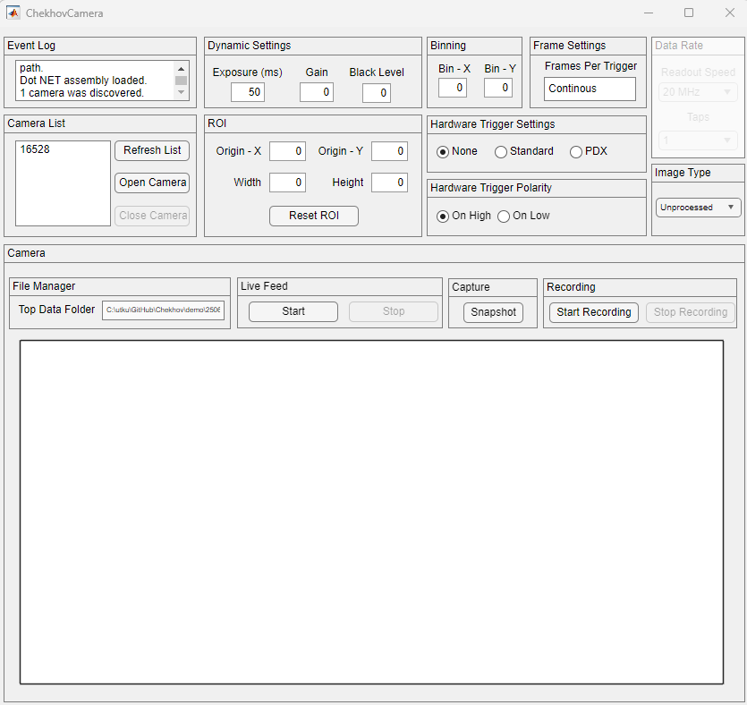</a>

The camera interface was modeled after the original Thorlabs interface. When a camera is found, a message appears in the Event Log and Camera List is updated, shown in red rectangle.

<a href="media/camera_found.png" target="_blank">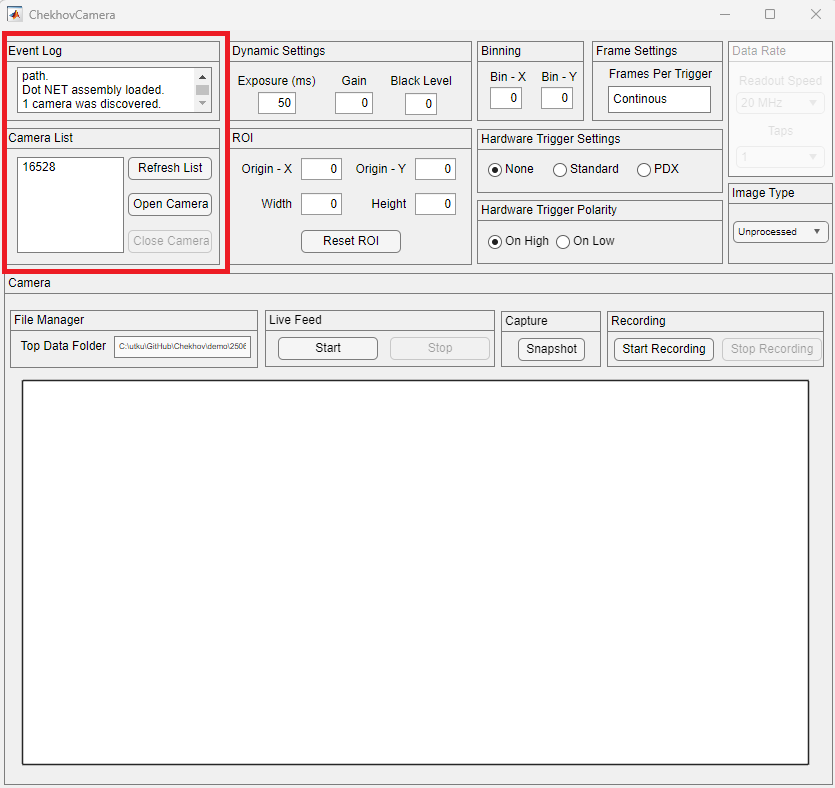</a>

Select the camera you want to open, by clicking the number in the list, shown in red rectangle. Then click Open Camera button.

<a href="media/select_camera.png" target="_blank">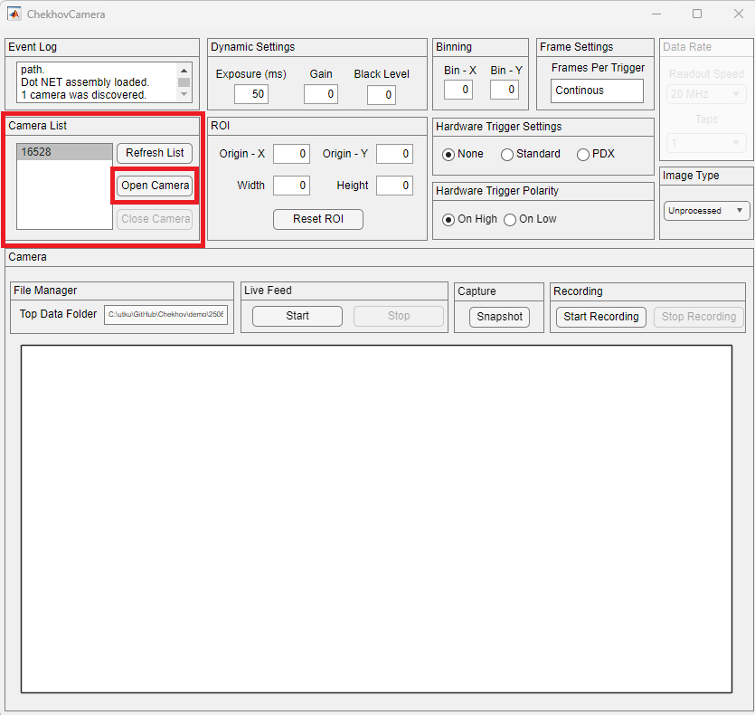</a>

The initial connection to the camera is to ensure that the all the required parts for camera operation is there. It is important to use Open Camera to "arm or turn on" the hardware. You can start the Live Feed by clicking the Start button in the Live Feed panel.

<video src="media/camera.mp4" controls="controls" style="max-width: 730px;"></video>

You can take a snapshot of the brightfield image by clicking the Snapshot button, shown in the red rectangle.

<a href="media/snapshot.png" target="_blank">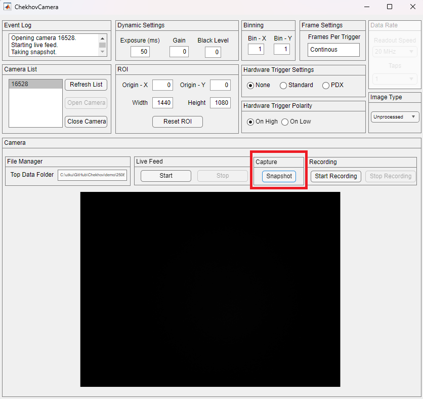</a>

A Windows file dialog opens for the snapshot file. Select the folder and name your file as preferred.

<a href="media/snapshot_save.png" target="_blank">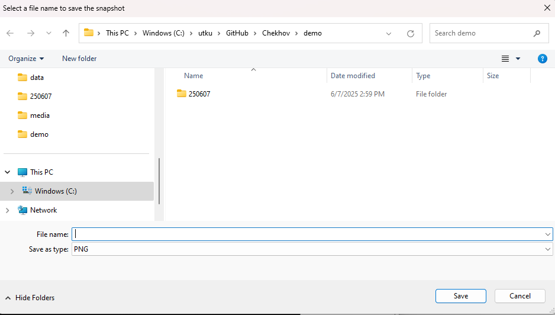</a>

You can also record a video of the region of interest. Click the Start Recording button, shown in the red rectangle.

<a href="media/start_recording.png" target="_blank">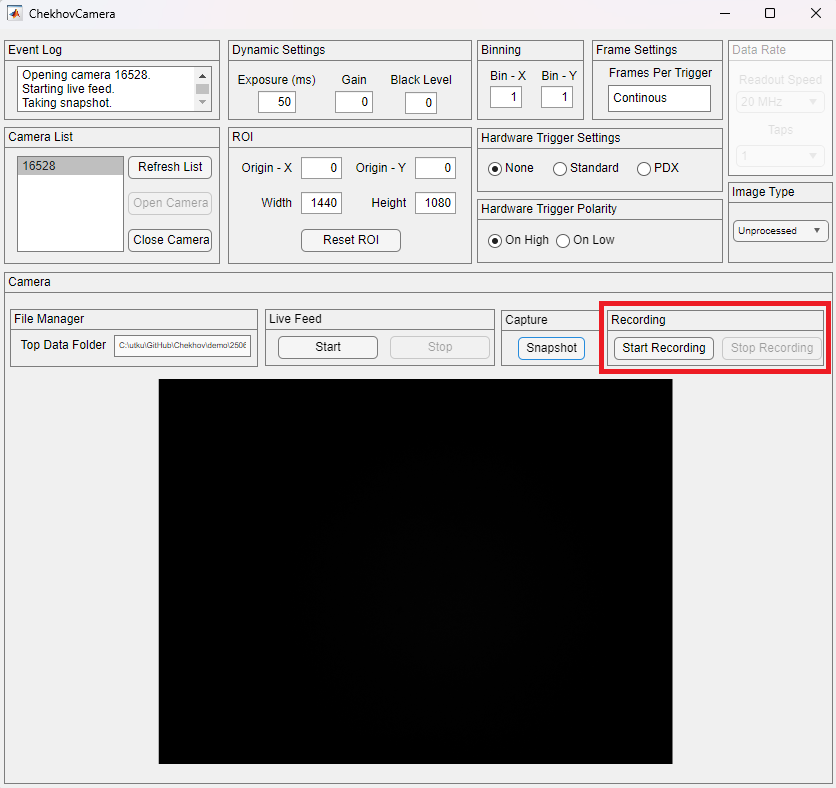</a>

A Windows file dialog opens for the recording file. Select the folder and name your file as preferred.

<a href="media/start_recording_file.png" target="_blank">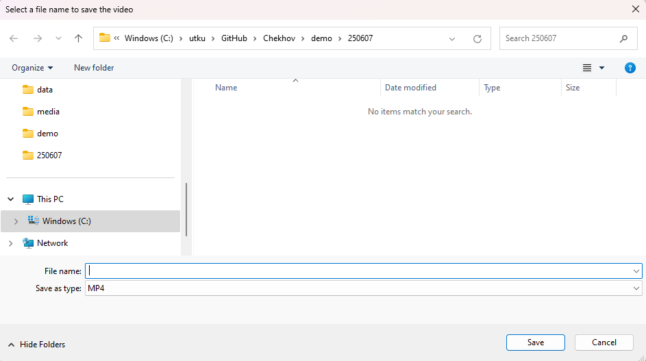</a>

Once you are done with the camera, click the Close Camera button, in red rectangle, and close the window.

<a href="media/close_camera.png" target="_blank">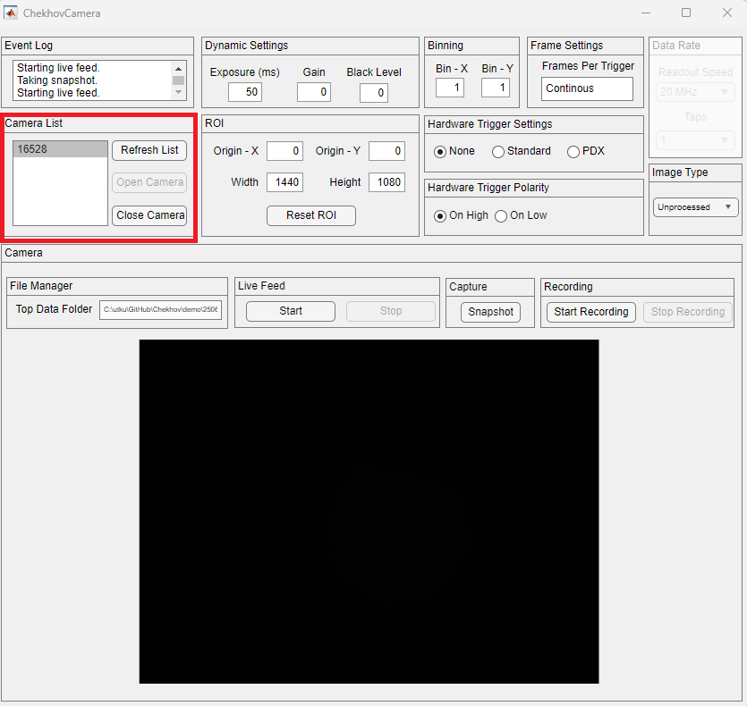</a>

### Pockel Cell Calibration

The first step of each experiment is to calibrate the Pockel cell. Pockel cell calibration is performed through another app within the Chekhov environment. The Calibration on the top menu opens a dropdown menu, shown in the red rectangle. The first option of the dropdown is the Pockel Cell.

<a href="media/pockel_cell_menu.png" target="_blank">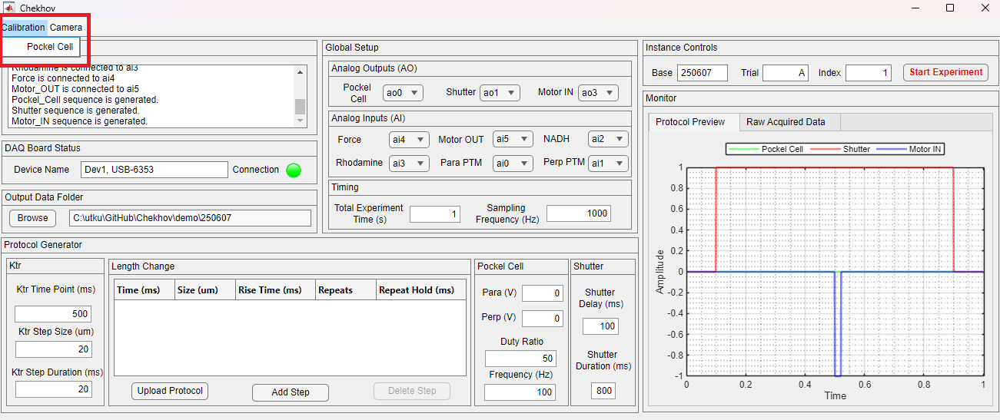</a>

Upon clicking the Pockel Cell button, it opens the ChekhovPockelCalibration window.

<a href="media/pockel_cell_calibration.png" target="_blank">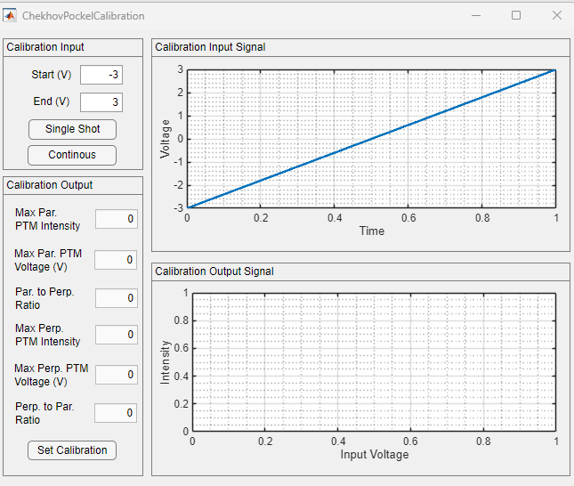</a>

This window allows users to first generate and send a simple signal, then collect the data from the parallel (Para) and perpendicular (Perp) photomultipliers (PTMs).

Upon clicking the Single Shot button, shown in red rectangle, program performs a dark current measurement followed by the calibration measurement. The dark current measurement corresponds to the background signal from the PTMs. Please note that the obtained intensities are just noise since this demo was recorded with no input from the instruments. The maximum Para and Perp intensities are automatically calculated and corresponding voltage valuess are printed.

<a href="media/pockel_cell_single_shot.png" target="_blank">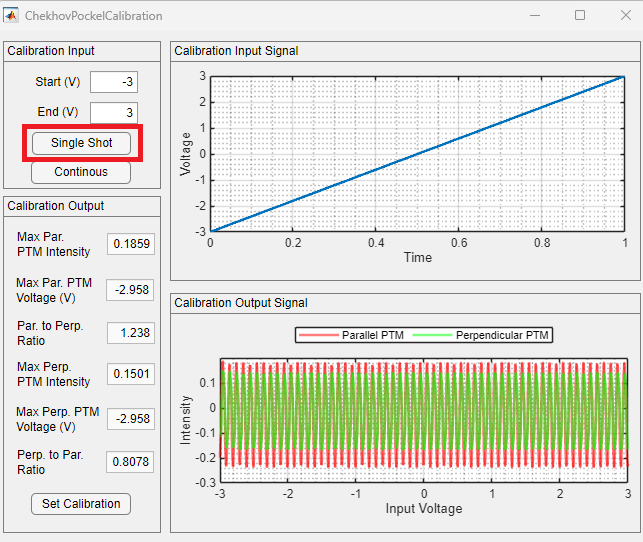</a>

If users would like to see the how slight adjustments alter the response in real time, they can use the continous button shown in the red rectangle.

<a href="media/pockel_cell_calibration_continous.png" target="_blank">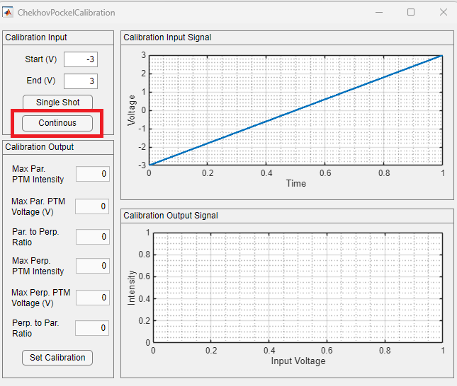</a>

<video src="media/pockel_cell_continous.mp4" controls="controls" style="max-width: 730px;"></video>

Upon re-clicking the continuous button, the feed stops. Once you are satisfied with the calibration, click the set calibration button, shown in red rectangle, to transfer the calibration values to the main window.

<a href="media/pockel_cell_set_calibration.png" target="_blank">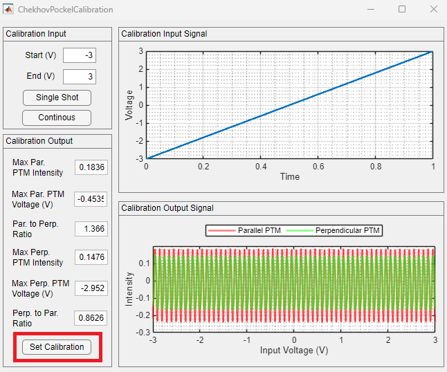</a>

Please note that the voltage values are transferred and the Pockel Cell signal is generated.

<a href="media/pockel_cell_calibrations_transferred.png" target="_blank">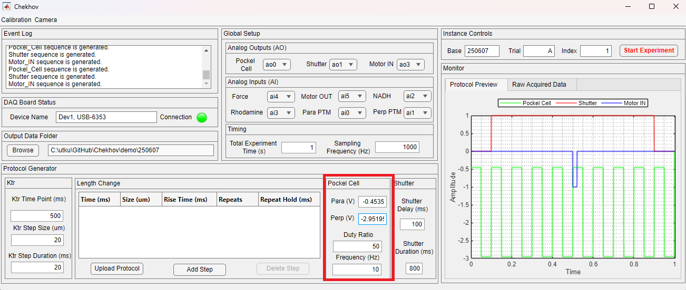</a>

### Global Setup

It helps users to map the input and output channels for each instrument. Timing and sample frequency are also assigned here. The original channel configuration is already set as default. But in the case where you need to rewire the DAQ, you can assign the new channels using the drop-down options for each instrument. Both analog and input channel assignments are shown in red rectangles below.

<a href="media/ao_dropdown.png" target="_blank">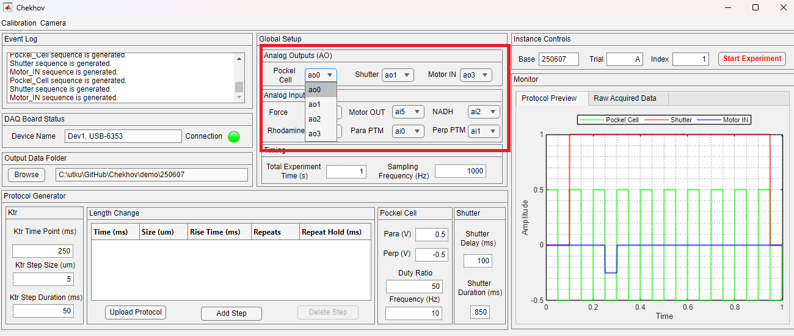</a>

<a href="media/ai_dropdown.png" target="_blank">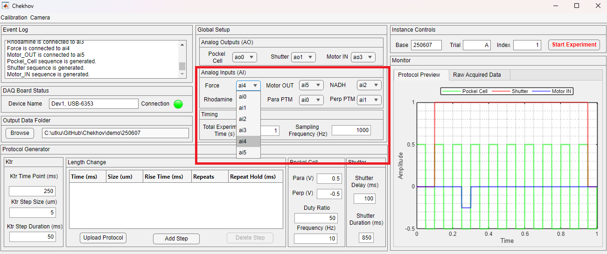</a>

Please note that each instrument has a unique channel assignment. A channel cannot be assigned twice.

You can also set the total experiment time in this panel, shown in red rectangle. Please note that the total experiment trace is increased to 10 seconds shown in the Protocol Preview in the Monitor panel.

<a href="media/total_experiment_time.png" target="_blank">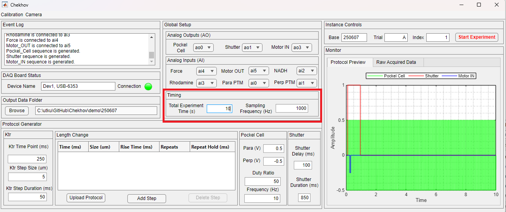</a>

### Protocol Generator

The parameters for the Analog Output (AO) instruments are assigned in this panel.

#### Ktr Parameters

Users can change the following parameters for the Ktr maneuver:

- Ktr Time Point (ms): The time point at which the maneuver starts.
- Ktr Step Size (um): The size of the length step.
- Ktr Step Duration (ms): Total elapsed time at the "slack".

The original signal is blue trace in the Protocol Preview window.

<a href="media/ktr_time_point.png" target="_blank">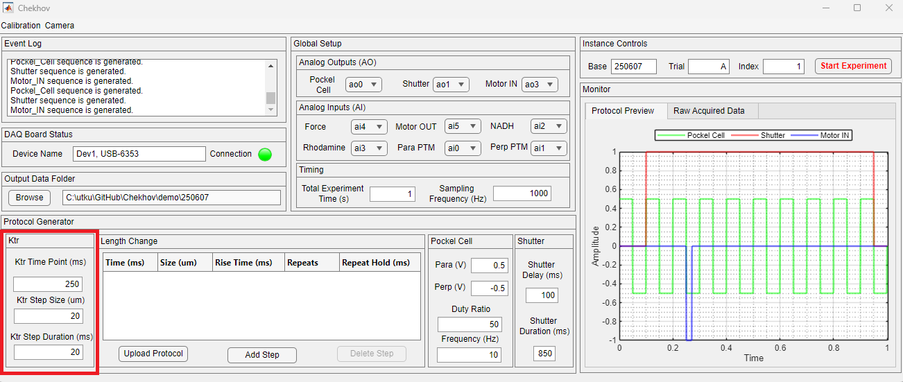</a>

Please note that size of the length step is reduced. The bottom "dip" of the blue trace is placed around -0.25 in the Protocol Preview.

<a href="media/ktr_step_size.png" target="_blank">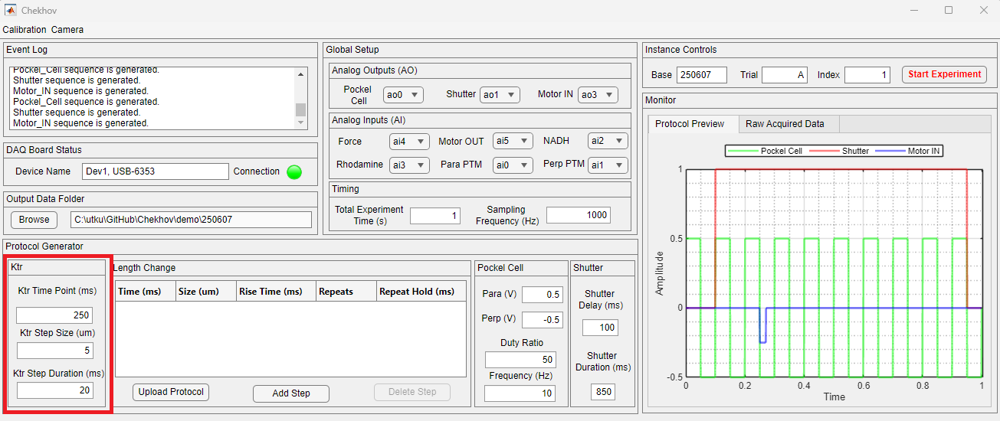</a>

Please note that width of the "dip" is increased in the Protocol Preview.

<a href="media/ktr_duration.png" target="_blank">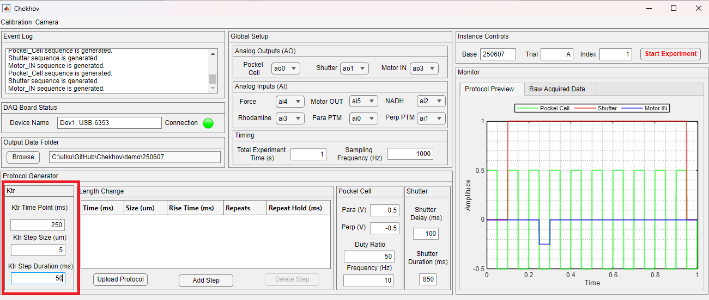</a>

#### Pockel Cell

Users can change the following parameters for the Pockel cell:

- Para (V): Required voltage to change the polarization to parallel. This value should be obtained from the calibration.
- Perp (V): Required voltage to change the polarization to perpendicular. This value should be obtained from the calibration.
- Duty Ratio: The ratio of time the square wave is active.
- Frequency (Hz): Number of transition occurrences between parallel and perpendicular voltages.

The Pockel cell signal is the green trace in the Protocol Preview window.

Please note that the original signal is shifted up and ranges between 0.5 to -0.5 V.

<a href="media/pockel_cell_calibrations_transferred_demo.png" target="_blank">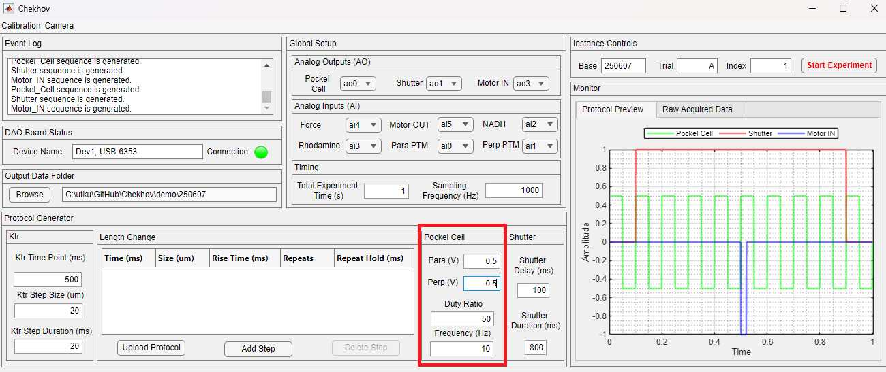</a>

Please note that the width of the square wave is decreased.

<a href="media/pockel_cell_duty_ratio.png" target="_blank">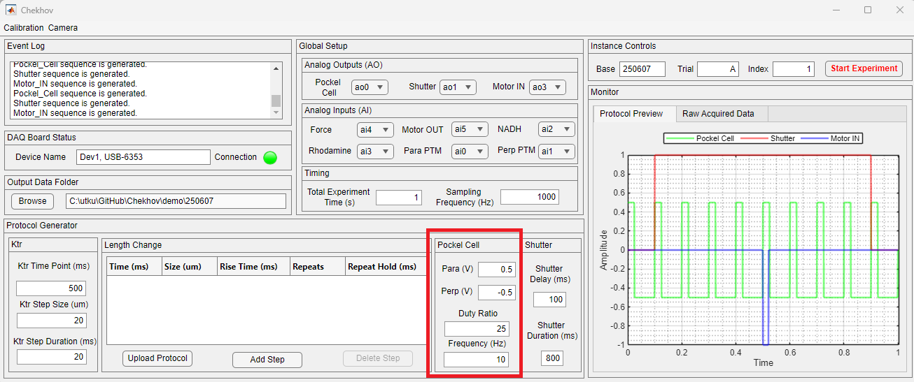</a>

Please note that the number of transitions is increased.

<a href="media/shutter_delay.png" target="_blank">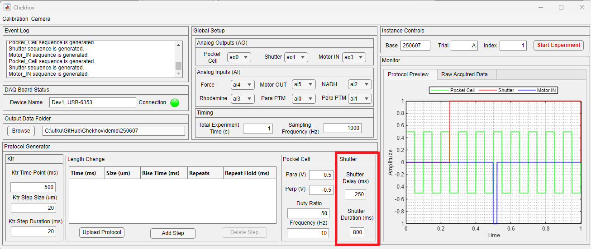</a>

#### Shutter

Users can change the following parameters for the shutter:

- Shutter Delay (ms): The timepoint at which the shutter first opens.
- Shutter Duration (ms): The total amount of time the shutter stays open.

The shutter signal is the red trace in the Protocol Preview window.

Please note that the shutter signal is shifted to the right with the delay.

Please note that the width of the shutter signal is decreased with the decreased duration.

<a href="media/shutter_duration.png" target="_blank">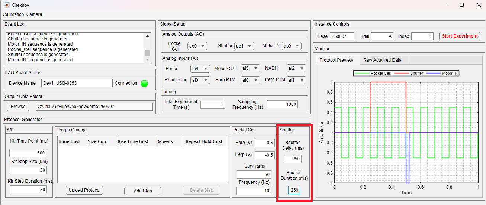</a>

#### Length Change

Users can the following parameters for the length changes:

- Time (ms): The time at which the length change starts.
- Size (um): The size of the length change. Can be positive and negative.
- Rise Time (ms): How quickly the prep reaches the new length. This can be a length step or a ramp.
- Repeats: Length changes can be repeated. This lets users to generate stairstep profiles.
- Repeat Hold (ms): How long the prep stays at the new length state.

You can upload a protocol file to auto populate the table. This file is a comma delimited text file. You must have a non-zero value for each parameter. An example is protocol file is shown below.

<a href="media/protocol_txt.png" target="_blank">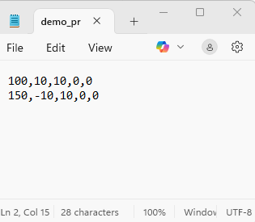</a>

Click on the Upload Protocol button, shown in red rectangle and select the protocol file through the Windows file dialog.

<a href="media/upload_protocol.png" target="_blank">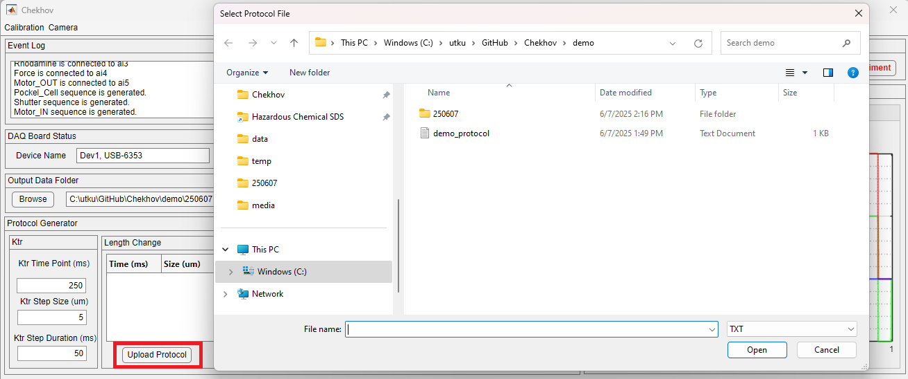</a>

The table is populated, and the new length output signal is generated, blue trace in the Protocol Preview window.

<a href="media/protocol_loaded.png" target="_blank">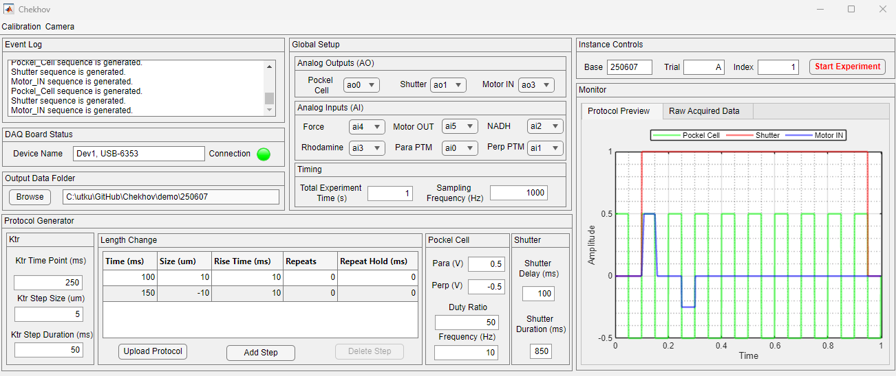</a>

You can modify the loaded protocol by simply double clicking and editing the cells you want to change. The following example first increases the first length step and then decreases the second one to go back to the original length.

<a href="media/size_change.png" target="_blank">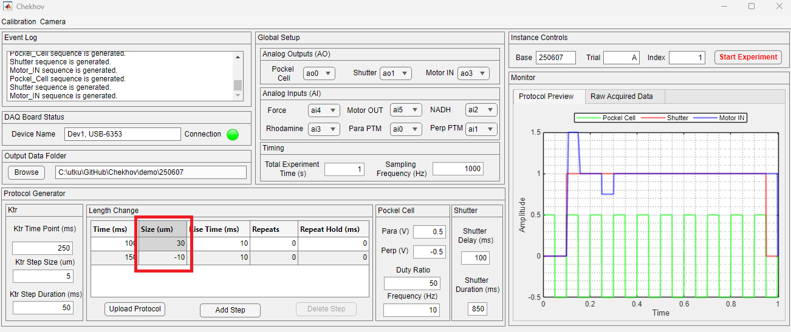</a>

<a href="media/size_change_2.png" target="_blank">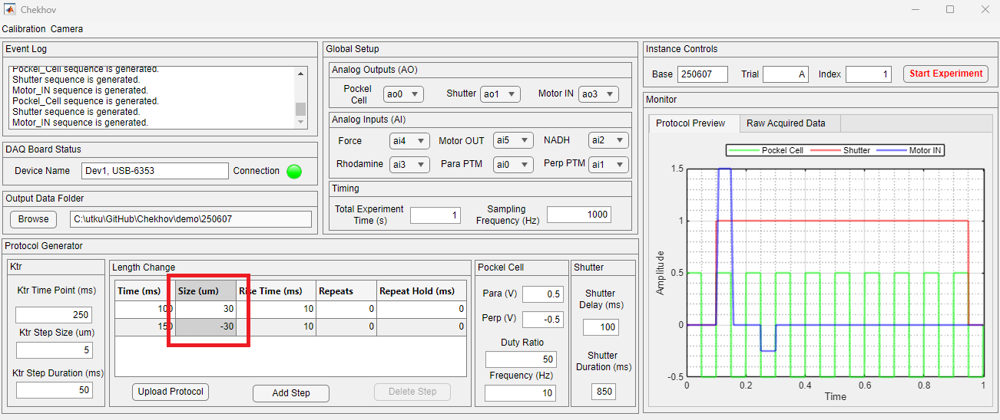</a>

You can add additional steps to the protocol. Click the Add Step button, shown in red rectangle. Please note that this duplicates the last step but increases the timepoint by 100 ms.

<a href="media/add_step.png" target="_blank">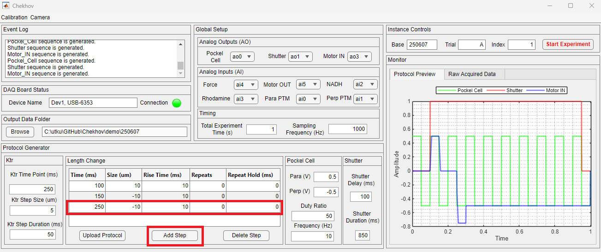</a>

You can further modify the length signal by changing the repeats and repeat holds. Please note that the length trace now involves, a ramp up, a ramp down, a ktr, and staircase, highlighted with the blue trace in the protocol preview.

<a href="media/change_step_parameters.png" target="_blank">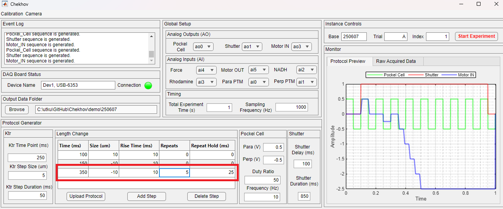</a>

You can delete any length step you want. Select the any cell on the length table and click the Delete Step button, shown in red rectangle. The entire row of the selected cell is deleted.

<a href="media/delete_step_selection.png" target="_blank">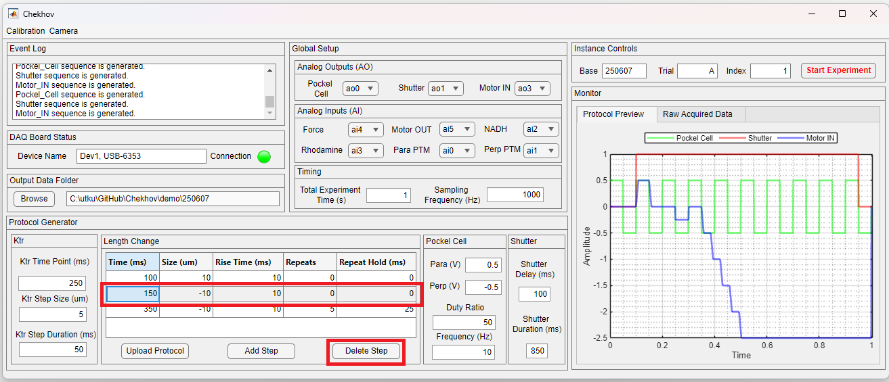</a>

### Start Experiment and Chekhov Outputs

Once all the experimental parameters are set, you can start your experiment by clicking the Start Experiment button, shown in the red rectangle. Similary to the Pockel cell calibration, the software performs a dark current measurement followed by the data collection.

<a href="media/go_back_to_original_start_experiment.png" target="_blank">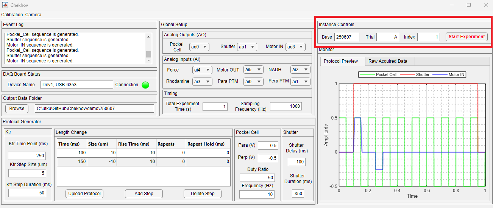</a>

Upon completion of the data collection, collected raw data is shown in the Raw Acquired Data window in the Monitor Panel. The experimental instance is automatically "flushed" and the Index value is increased by 1. All these events are reported by the Event Log. Please note that the collected data is mostly noise at this point.

<a href="media/experiment_done.png" target="_blank">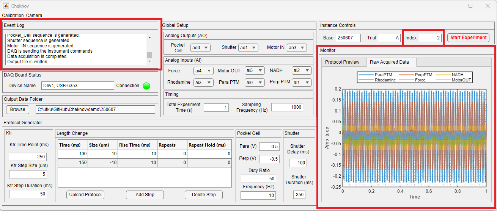</a>

The collected data and the metadata file are stored in the previously selected Output Data Folder. The metadata file stores all the provided, generated, and collected information from that specific instance. At the moment, these files can be opened with MATLAB as a .MAT file. In the future, these files can be loaded into the Chekhov environment.

<a href="media/out_folder.png" target="_blank">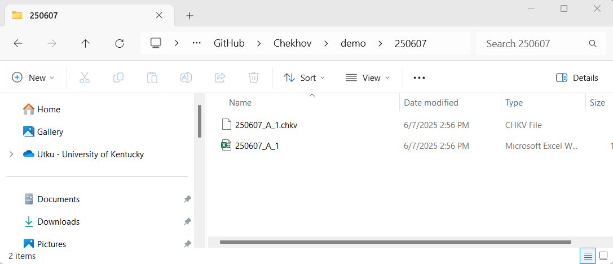</a>

The data Excel file has the timestamps, both dark current and experiment input and output signals. Subsequent analysis can be performed with this file.

<a href="media/excel_file.png" target="_blank">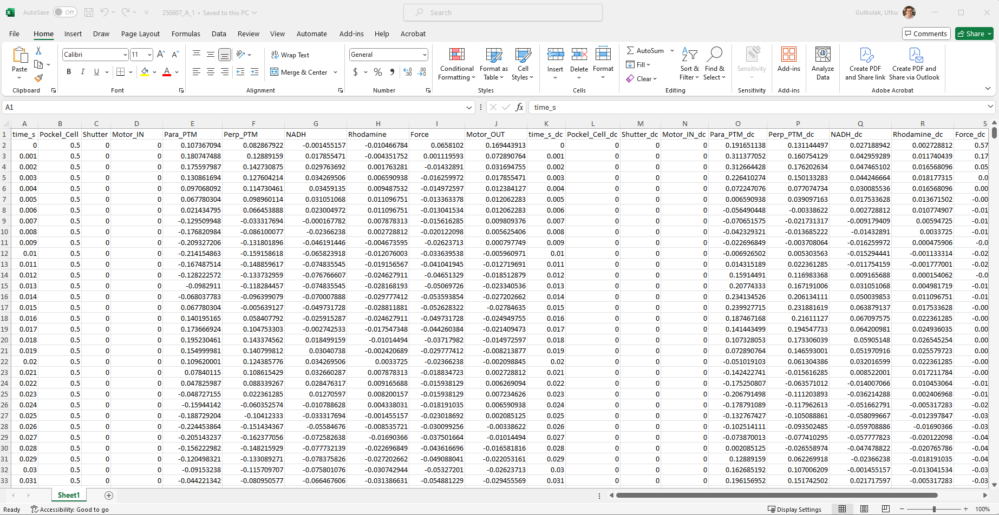</a>

